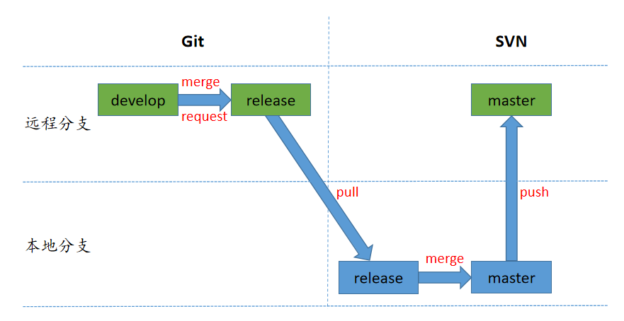

[TOC]

本文档描述搭建 `GitLab` 服务器

# 基于Ubuntu 18.04 搭建 GitLab CE 服务器

## 1. 从 官网 下载安装包及相关文件

[GitLab CE](https://packages.gitlab.com/gitlab/gitlab-ce) 

如果从官网下载速度较慢，可以参考 [清华大学镜像源web](https://mirrors.tuna.tsinghua.edu.cn/) 

1. 打开Web界面，`Ctrl + F` 搜索 `ubuntu/bionic` 如下图所示


2. 安装第一步相关提示，完成配置


manually update repository

```shell
curl -s https://packages.gitlab.com/install/repositories/gitlab/gitlab-ce/script.deb.sh | sudo bash
```

install

```bash
sudo apt-get install gitlab-ce=14.9.5-ce.0
```

3. 安装完成


## 2. GitLab 配置

```bash
# 设置IP地址和端口号
sudo vi /etc/gitlab/gitlab.rb
# 找到下面一行, 修改
external_url 'http://example.com'  # 修改成目标IP地址和端口号 
# 如：external_url 'http://192.168.20.1:8088'

# 配置
gitlab-ctl reconfigure
# 加载配置后重启
gitlab-ctl restart

```

## 3. 登陆

在浏览器地址栏输入: 

``` http
http://192.168.20.146:8089
```

首次登陆用户名为 `root`， 密码在以下文件中初始化：

```bas
sudo vi /etc/gitlab/initial_root_password
```


## 3. GitLab 自启动

```bash
systemctl enable gitlab-runsvdir.service
```

# 2. Git 的基本使用说明


## Windows

在Windows中可以使用 Git和TortoiseGit工具使用Git, 也可以使用GitBash进行管理。(如果对命令行不熟悉优先推荐使用TortoiseGit)

### 安装TortoiseGit


### 配置


### 使用PuttyKey配置远程管理秘钥

在将本地的仓库推送到远程，或从远程更新时，会提示输入配置的密码。

可以在本地代码生成ssh-key 秘钥，在远程仓库添加。然后基于Putty配置秘钥，添加到TortoiseGit中，避免每次输入密码。


1. 使用Putty 加载秘钥文件

   


2. 加载秘钥文件并生成putty key 文件


## Linux 


# 3. Git SVN 双版本控制库使用说明

> 为了更好的进行部门代码管理，同时遵从公司代码管理要求。物理算法部门使用Git SVN进行部门内的代码管理。
>
> 总体原则为维护一套代码，平时开发时基于Git进行分支管理，代码评审等代码管理操作，版本发布基于SVN，在版本发布时基于git svn同步git远程仓库的develop分支到svn本地分支，然后push到svn的远程分支。

两个逻辑关系如下图所示


## 详细说明

物理算法部门代码管理具体分为日常开发过程中的代码管理和版本发布时的代码管理。其中日常开发过程中基于git版本管理工具，面向部门所有开发人员，版本发布过程基于svn版本管理工具，由具体个人负责，部门开发人员不涉及此部分内容。

### 个人开发

部门内所有开发人员开发过程中，只涉及Git版本工具的使用。具体使用规则为：

在接到新的功能开发任务或者bug修复任务时：

1. 拉取最新的远程develop分支到本地
2. 基于最新的develop分支创建新的分支
3. 在新的分支上开发，测试，可以实时提交到远程个人分支
4. 基于远程新分支提交合并请求，合并到远程develop分支


### 版本发布

版本发布时基于SVN版本管理工具，只需要代码管理员进行管理。具体使用规则为

在需要进行版本发布时：

1. 在Git远程分支提交develop分支到release的合并请求
2. 在SVN本地分支拉取Git远程release分支
3. 在SVN本地，合并release分支到master
4. push SVN master分支到SVN远程仓库




