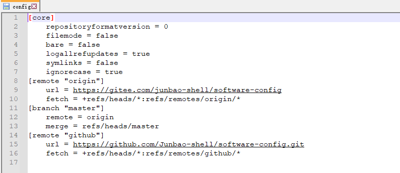

[TOC]

# 介绍
对日常工作中使用的git基本语法进行积累

# 配置

## user & email
git 可以通过两种方式配置自己的用户名和邮件
第一种：如果工作环境是完全是自己的独立环境，如工作在自己的笔记本电脑，不会有他人使用到，可以设置一个全局的git config
```shell
git config --global user.naem "user-name"
git config --global user.email "email@domin.com"

# 查看配置
git config --list
```

第二种：当前的工作环境中涉及多人合作，只希望在自己的当前目录下配置git
```shell
git config user.name "user-name"
git config user.email "email@domin.com"
```

git config 配置选项最终都是将相关配置写入到文件中 ~/.git/config 文件中文件格式如下：


## ssh key

关于ssh key 原理的一些介绍 `https://www.jianshu.com/p/1246cfdbe460`

利用 ssh key, 可以在登陆SSH服务器时，无需输入密码，直接 git pull, git push 即可

生成 git 的ssh 秘钥
通过 ssh-keygen 支持 RSA, DSA 两种认证秘钥
`ssh-keygen -t rsa -C "email@email.com" -b 2048`


如何创建多个ssh key 而不是覆盖默认文件
在创建ssh key时自行输入路径和文件名称，而非使用默认路径和文件名即可


# git content

## `git clone`
克隆整个仓库
```git
git clone https://gitee.com/junbao-shell/software-config.git
```

只克隆指定的分支
```shell
git clone --single-branch --branch <branch_name> <remote=repository-url>

# 或者
git clone --single-branch -b <branch_name> <remote-repository-url>
```

## `git branch & git tag`

## `git remote`

## `git commit`


## `git pull & git push`

```git
git push origin master
```
## `git merge`

## `git rebase`

## `git log`

## `git checkout`


