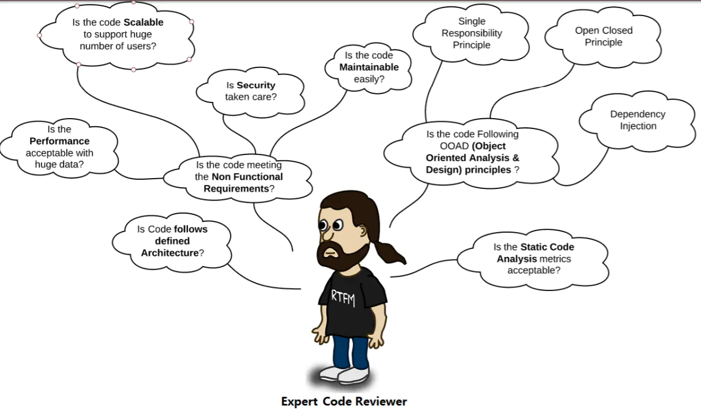

[TOC]

## 代码评审

代码评审时开发人员检查代码发现bug，审查编码规范，发现潜在的性能瓶颈和资源泄露的过程。在应用到产品或者对外发布之前尽可能找到各种bugs, issues, defects.

代码评审时审查现有代码并从中学习的过程。而不是去讨论设计思想。（看到有疑问或者比较好的设计，可以记录下来，后续讨论）

[What not to do](https://wiki.openmrs.org/display/docs/Code+Review+Checklist)  

+ Design
  Code review is a process to review existing code and learn from it, not the time or place to discuss design ideas.  If design ideas come to mind, write them down separately and discuss them outside of the code review.
+ Writing code
  If you are writing any code, you are not reviewing.  The only exception would be a short line of two of code within a comment to help communicate a defect or suggested fix.
+ Judge
  Code review is a chance for everyone to learn and make better code while improving the code for the community.  We all make mistakes and we all have opportunities to learn.  Defects in code are an opportunity to learn and improve for everyone.

## 代码评审流程

git clone code_address

git pull

git branch New-Feature

git checkout New-Feature

... write code

git commit 

git push 

create merge

code review

merge to release branch

## Check List

1. 可维护性
   + 代码的意义是否明确
   + 代码是否符合约定的编码规范
   + 代码是否符合公认的最佳实践
   + 代码是否符合公认的评论约定

2. 错误处理
   + 代码是否符合公认的异常处理约定
3. 安全
4. 资源泄露
5. 控制结构
6. 可重用性

